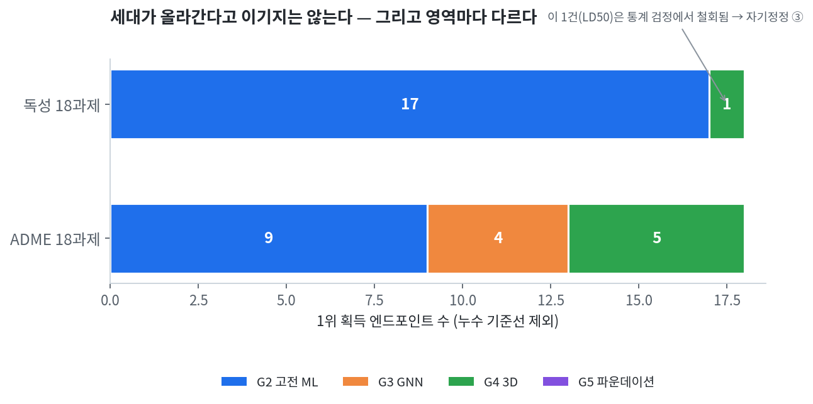
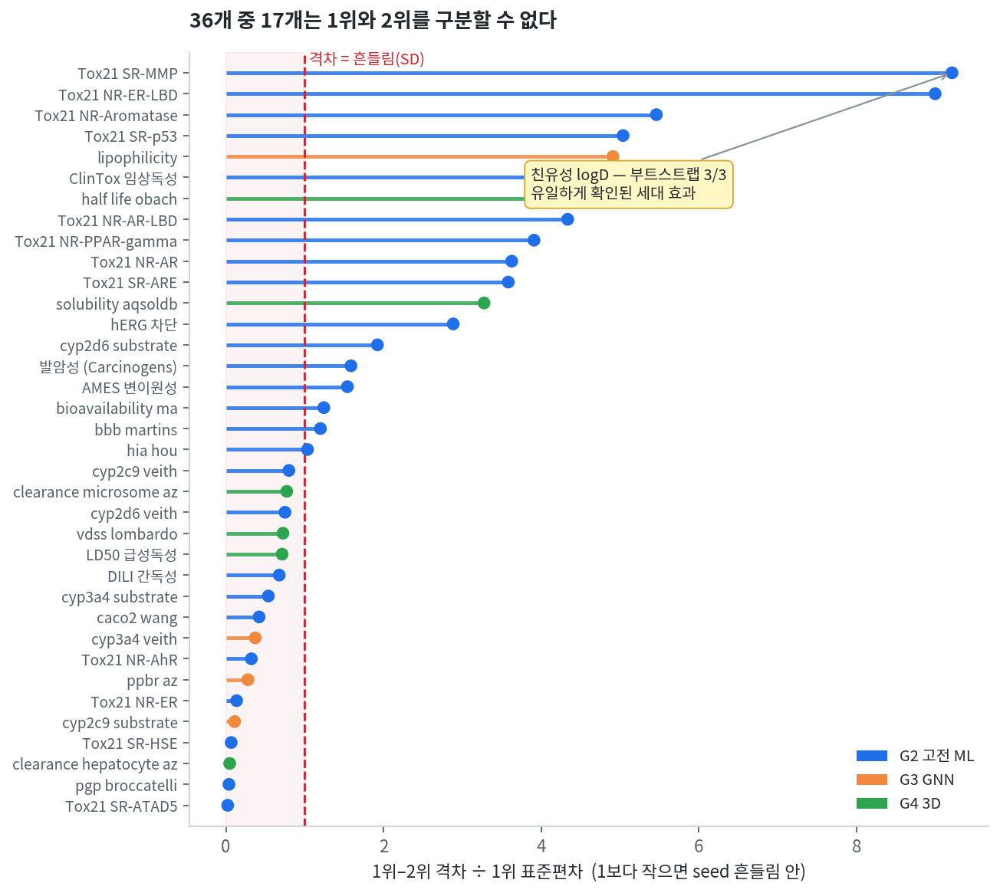
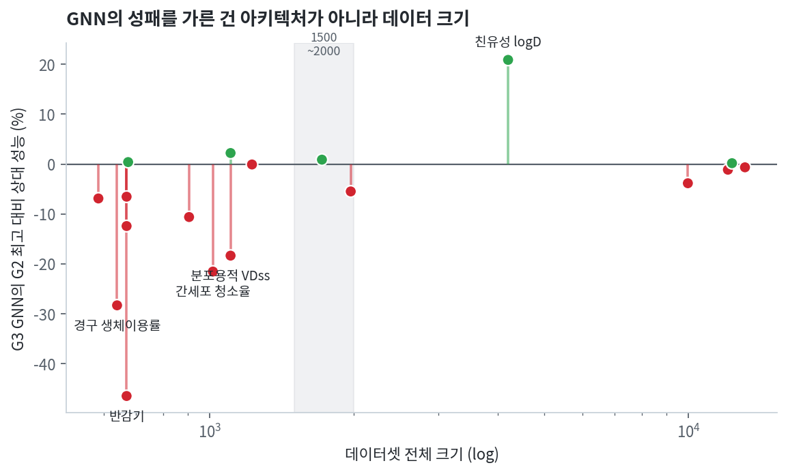
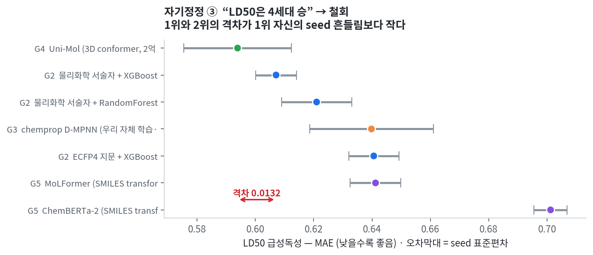
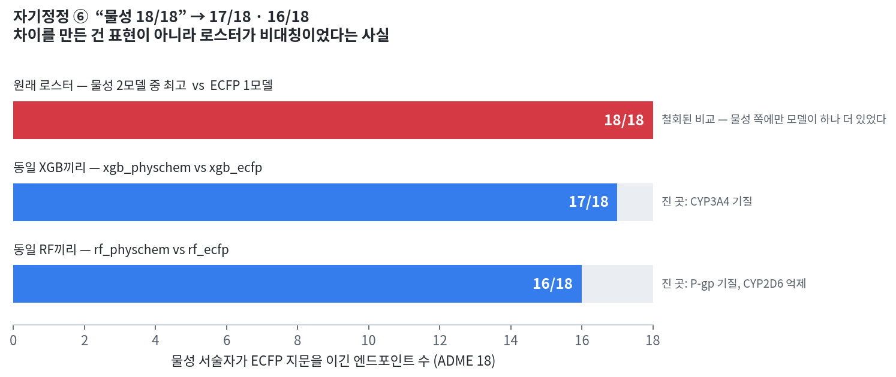
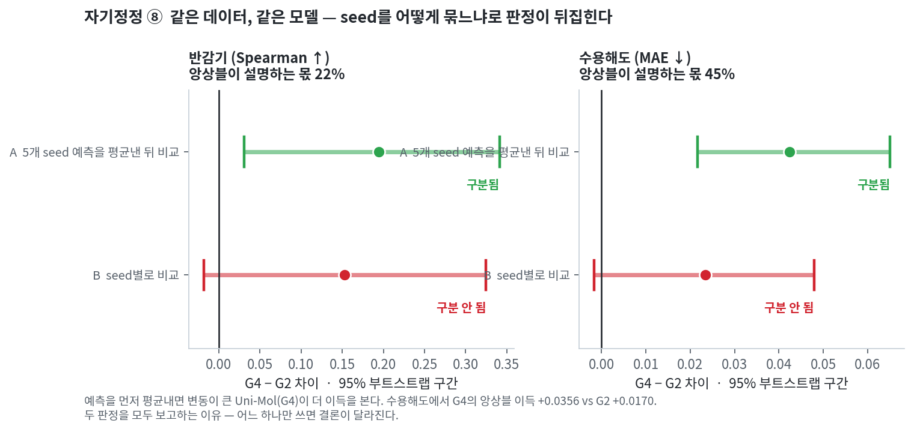

# ADMET 세대 벤치마크

> **규칙 기반 → 고전 ML → GNN → 3D → 파운데이션 모델.**
> 5개 모델 세대를 36개 ADMET 엔드포인트(독성 18 + ADME 18)에서 **동일 분할·동일 지표**로 다시 재본 결과,
> 세대가 올라간다고 성능이 따라 올라가지는 않았다 — 그리고 **언제 올라가는지는 측정할 수 있었다.**

**In three lines (EN)**

1. Across 36 ADMET endpoints under identical splits and identical metrics, newer model generations did not reliably beat older ones: classical ML topped 17 of 18 toxicity tasks, while ADME split four ways (gen-2: 9, gen-4: 5, gen-3: 4, gen-5: 0).
2. Only 1 of 36 endpoints showed a generation effect that survived resampling (lipophilicity/logD → gen-3 GNN, 3/3 bootstrap comparisons); in 17 of 36 the first and second place could not be told apart at all.
3. A widely used public ADMET predictor scored **higher on our held-out test set than the figure reported in its own paper** — one of three contamination signatures — so it was removed from the ranking and kept only as a reference line.

📊 **[보고서 전체 보기 (GitHub Pages)](https://Nudge92.github.io/admet-generation-benchmark/)**

---

## 왜 이걸 만들었나

### ① 자를 대보니, 자가 고장나 있었다

공개 배포된 ADMET 예측기를 기준선으로 삼으려 했다. 그런데 이상한 일이 생겼다.

> **그 도구가 자기 논문에 보고한 성능보다, 내 test set에서 더 잘했다.**

보통은 반대여야 한다. 남의 데이터, 남의 분할에서는 성능이 **떨어지는** 게 정상이다. 올라간다는 건 그 도구의 학습 데이터가 내 평가셋 안에 들어와 있다는 뜻이다.

누수 증거는 셋이었다 — ⑴ TDC 전체로 사전학습 ⑵ 자체보고 성능 초과 ⑶ 누수 없이 학습한 동종 모델과의 격차(핵심 4종 0.088 · 확장 0.149). 기준선으로 쓸 수 없어서 순위 판정에서 빼고, 참고선으로만 남겼다.

### ② 그래서 자를 직접 만들었다

기준선이 없으면 만들어야 한다. 모델을 다섯 세대로 나누고 —

| 세대 | 접근 | 이 벤치마크에서 쓴 것 |
|:--:|---|---|
| G1 | 규칙 기반 | 구조 경보 (BRENK + NIH + Benigni-Bossa SMARTS) |
| G2 | 고전 ML | 물리화학 서술자 / ECFP4 지문 × XGBoost · RandomForest |
| G3 | GNN | chemprop D-MPNN (누수 없이 자체 학습) |
| G4 | 3D | Uni-Mol (3D conformer, 2억 분자 사전학습) |
| G5 | 파운데이션 | ChemBERTa-2 · MoLFormer (fine-tune) |

— 36개 엔드포인트에서 **분할·지표·평가 절차를 완전히 고정한 채** 다시 쟀다. test set 정의는 이 저장소에 들어 있고([`splits/`](splits/)), 확정된 예측 파일에서 역산한 뒤 두 번 대조했다([`scripts/extract_splits.py`](scripts/extract_splits.py) — seed 간 0건 · 모델 간 0건 불일치).

### ③ 내가 만든 자도 의심했다

자를 직접 만들었다고 그 자가 정확하다는 보장은 없다. 그래서 적대적 검증을 걸었다 — 같은 알고리즘으로 표현만 바꿔보기, seed 재현 반복, 부트스트랩, DeLong 정확검정, 집계 방식 민감도 분석.

그 결과 **내 초기 결론 중 8건이 뒤집히거나 철회됐다.** 그중 하나(⑤ 멀티태스크 이득)는 나에게 유리한 결론을 내 손으로 기각한 것이다. 8건 전부를 아래에 공개한다. ([→ 자기정정 8건](#자기정정-8건))

### ④ 재는 것과 쓰는 것은 다르다

순위를 매기는 일과 실제로 배포하는 일은 다른 문제다. AUROC 0.836짜리 모델도 기본 임계값 0.5에서는 **양성을 하나도 못 잡았다**(Tox21 NR-PPAR-gamma: 민감도 0.000 · 특이도 1.000). 권고 작동점 t\*=0.157로 내려야 민감도 0.304가 되고 놓친 양성이 46→32건으로 준다. ADME CYP2C9 기질은 0.5에서 민감도 0.026 — 양성 37건 중 36건을 놓친다.

적용 도메인(AD)도 만능이 아니었다. 독성 18과제에서 AD가 실제로 신뢰도를 갈라낸 건 **11건**뿐이고, 3건은 OOD에서 오히려 성능이 안 떨어졌으며, 4건은 표본이 모자라 판정 자체가 불가능했다.

그래서 이 저장소에는 순위표만이 아니라 **엔드포인트별 권고 작동점과 AD 유효 여부**가 함께 들어 있다([`results/reliability.csv`](results/reliability.csv)).

---

## 핵심 발견

### 1. 세대는 단조롭게 좋아지지 않는다



**독성 18과제** — 2세대(고전 ML)가 17개에서 1위. 누수 없이 학습한 3세대 GNN의 1위는 **0개**, 5세대도 **0개**. DeLong 대응비교에서 유의한 차이는 17건 중 10건이었고 **전부 2세대 우세**였다(LD50은 회귀 과제라 DeLong 대상이 아니어서 분모가 17이다). 남은 1개는 4세대가 LD50에서 가져갔지만 — **그 1승은 통계 검정에서 철회됐다**(→ 자기정정 ③). 4세대가 독성에서 평가된 기회는 애초에 4회뿐이었고, 순위상 1/4, 검정 후 **0/4**다.

**ADME 18과제** — 결과가 갈렸다. 2세대 9 · 4세대 5 · 3세대 4 · 5세대 0.

즉 "세대 ↑ = 성능 ↑"는 두 영역 어디에서도 성립하지 않았고, **영역에 따라 승자 분포 자체가 달라졌다.**

### 2. 36개 중 17개는 1위와 2위를 구분할 수 없다



순위표에서 1위가 바뀌는 것과, 그 차이가 흔들림보다 큰 것은 다르다. **36개 중 17개에서 1위–2위 격차가 1위 자신의 seed 표준편차보다 작았다.** 순위는 있지만 그 순위를 근거로 쓸 수 없다는 뜻이다.

재표집까지 통과한 세대 효과는 **친유성(logD) 하나**였다. 3세대 GNN이 2세대 세 모델 전부를 이겼고, 부트스트랩 신뢰구간이 셋 다 0을 넘지 않았다(**3/3**).

### 3. GNN의 성패를 가른 건 아키텍처가 아니라 **데이터 크기**



| 데이터셋 전체 크기 | 2세대 최고 대비 GNN 평균 성능 |
|---|---:|
| n < 1500 (11개) | **−13.5%** |
| n ≥ 2000 (5개) | `【확인 중】` |

작은 데이터에서 GNN이 진 것은 GNN이 나빠서가 아니라 **데이터가 모자라서**로 읽는 게 자연스럽다. 그리고 위의 유일한 확실한 세대 효과(logD, +20.9%)도 큰 데이터 쪽에서 나왔다.

---

> ### 이 결과가 말하는 것 / 말하지 않는 것
>
> **말한다** — 세대가 올라간다고 성능이 자동으로 올라가지는 않는다. 데이터 규모와 엔드포인트의 성격이 세대보다 큰 변수였다. 그리고 대부분의 순위 차이는 통계적으로 얇다.
>
> **말하지 않는다** — "딥러닝은 별로다". 이 저장소는 반대 방향의 증거도 직접 만들었다. 데이터가 충분한 logD에서는 3세대 GNN이 부트스트랩 3/3으로 이겼고, ADME 18과제 중 5개에서는 4세대가 1위다. 5세대의 0승도 "모델의 한계"가 아니라 **이 예산·이 튜닝 조건에서의 결과**로 읽어야 한다(→ [한계](#한계)).
>
> 결론의 정확한 형태는 **"조건에 따라 다르다"** 이고, 이 저장소가 하려는 일은 그 **조건이 무엇인지를 재는 것**이다.

---

## 보고서

HTML 보고서는 GitHub Pages로 공개되어 있다. (저장소에서 `.html`을 클릭하면 소스가 보이므로 아래 링크로 볼 것)

| 보고서 | 내용 |
|---|---|
| **[통합 보고서 ★](https://Nudge92.github.io/admet-generation-benchmark/master_integrated_report.html)** | 36과제 전부 · 배포 가이드 · 자기정정 8건 — **여기부터 보면 된다** |
| [독성 세대 벤치마크](https://Nudge92.github.io/admet-generation-benchmark/master_report.html) | 독성 18과제 · §11 배포 가이드 |
| [독성 배포 신뢰도](https://Nudge92.github.io/admet-generation-benchmark/reliability_report.html) | 작동점 · AD · 보정 |
| [ADME 3축 보고서](https://Nudge92.github.io/admet-generation-benchmark/report_adme_full.html) | ADME 18과제 (세대 · 특징 · 학습방식) |
| [ADME 배포 신뢰도](https://Nudge92.github.io/admet-generation-benchmark/adme_reliability_report.html) | §7 배포 가이드 |
| [G4 검증](https://Nudge92.github.io/admet-generation-benchmark/g4_verification.html) | 반감기 · 수용해도 4세대 재검증 |

📄 학회 초록: IEIE 2026 (ADME 세대 벤치마크) — [`notes/abstract_IEIE2026/`](notes/abstract_IEIE2026/)

---

## 재현 방법

원본 데이터셋은 저장소에 넣지 않았다(TDC에서 재다운로드). 대신 **어느 분자가 test set인지에 대한 정의는 전부 커밋되어 있다.**

```bash
git clone https://github.com/Nudge92/admet-generation-benchmark.git
cd admet-generation-benchmark
pip install -r requirements.txt

# 1. 커밋된 test set 정의 확인 (36개 · sha256 지문 포함)
head splits/_manifest.csv

# 2. 예측 원자료에서 지표 재계산
python scripts/verify_results.py --predictions predictions/ --against results/

# 3. 그림 재생성
python scripts/make_figures.py
```

### 무엇이 어디까지 재현 가능한가

이 저장소가 재현을 보장하는 범위는 층마다 다르다. 정확히 적어둔다.

| 층 | 상태 |
|---|---|
| **test set 정의** | 36개 전부 커밋. 확정 예측 파일에서 역산했고 seed 간·모델 간 대조 0건 불일치 |
| **집계 지표** | `results/*.csv`가 보고서에 실린 확정 수치. 보고서 HTML은 여기서 생성됨 |
| **예측 원자료** | **G2·G3 구간은 전부, G4·G5는 일부.** 독성은 챔피언 재현 학습으로 18/18을 메웠고(Δ≤0.0001), ADME는 logD만 메웠으며 G4·G5는 한계로 남겼다 |
| **DeLong·부트스트랩 재계산** | 예측 원자료가 있는 구간에 한해 가능 |
| **모델 재학습** | 보장하지 않음. 체크포인트·원본 데이터 미포함 |

`configs/`에 seed가 명시되어 있다. **seed 집계 방식(예측 평균 vs seed별)에 따라 결론이 뒤집힌 사례가 실제로 있으므로**(→ 자기정정 ⑧), 비교하려면 집계 방식을 먼저 맞춰야 한다.

### "동일 분할"의 정확한 의미

엔드포인트 **안에서** 모든 모델이 같은 test set을 쓴다는 뜻이다. 엔드포인트 **사이**에 같은 분자를 쓴다는 뜻이 아니다(Tox21만 해도 assay별 n_test가 1051~1437로 다르다 — 라벨이 희소해서 정상이다).

예외가 하나 있다. **Uni-Mol(G4)은 3D conformer 생성에 실패하는 분자를 평가할 수 없다.** 반감기 134개 중 6개, 수용해도 1995개 중 17개가 여기 해당한다. G4 비교에서는 같은 분자를 G2에서도 제외해 짝을 맞췄지만(교집합 Jaccard 1.0), **G4 비교만 약간 작은 test set 위에서 이뤄진다.**

---

## 예측기 사용법

> 🚧 **작성 예정** — 통합 파이프라인 v2 완성 후 채웁니다.
>
> 예정 기능: SMILES 입력 → 36개 엔드포인트 예측 → 엔드포인트별 권고 작동점 적용 → AD 밖일 경우 경고.
>
> 임계값 0.5는 이 벤치마크에서 사용 불가로 판정된 엔드포인트가 있으므로, 파이프라인은 `results/reliability.csv`의 `t_star` 열을 기본 작동점으로 쓸 예정입니다.

---

## 자기정정 8건

벤치마크를 만드는 과정에서 내 초기 결론 8건이 뒤집히거나 철회됐다. **"무엇이 잡아냈나" 열이 이 표의 핵심이다** — 각 항목은 실수의 목록이 아니라, 걸어둔 검증 장치가 실제로 작동한 기록이다.

| # | 처음 주장 | 정정 후 | ★ 무엇이 잡아냈나 |
|:--:|---|---|---|
| ① | 공개 도구의 초과분 = "누수 프리미엄" | **"누수 상한"으로 격하** — 5모델 앙상블 × 31과제 멀티태스크가 교락되어 누수 단독 효과를 분리할 수 없음. 깨끗한 추정치는 +0.049~0.074 | 교락 변수 점검 (적대검증 CRITICAL) |
| ② | 세대 구분선을 "세대 최고 − 세대 최저" 폭으로 측정 | **"1위 vs 2위 격차"로 변경** — 바꾸자 LD50 핵심 4종이 4/4 모두 구분 불가로 뒤집힘 | 지표 정의 감사 (적대검증 CRITICAL) |
| ③ | "LD50은 4세대 승 — 유일한 세대 효과" | **철회** — 1위·2위 격차 0.0132가 1위 자신의 seed 표준편차 0.0185보다 작음. 핵심 4종 G4 **0/4** | ②의 직접 결과 |
| ④ | Hanley-McNeil 근사로 AUC 비교 (유의 3건) | **DeLong 대응비교로 교체 (유의 10/17건)** | 검정 방법 교체 |
| ⑤ | "멀티태스크 학습에 이득이 있다 (9/10)" | **가설 기각** — 이득의 88.9%가 누수의 산물. 누수 없는 CYP 억제에서는 +0.0004 | 누수 대조 분석 · **자체 발견** |
| ⑥ | "물성 기술자 18/18" *(철회된 표현)* | **17/18 (동일 XGB) · 16/18 (동일 RF)** — 원인은 비대칭 로스터(물성 2모델 vs ECFP 1모델) | 적대적 검증 6렌즈 중 **5개**가 반응 |
| ⑦ | "배설 3종 4세대 우세" *(철회된 표현)* | **반감기만 뚜렷**(Δ0.156 > SD). 간세포 청소율 Δ0.0025 ≪ SD 0.0514, 마이크로솜 Δ0.0258 < SD 0.0288 → 동률 | 효과크기 vs 표준편차 대조 |
| ⑧ | G4 검증 판정 "구분됨" 확정 | **판정이 seed 처리 방식에 의존** — 예측 평균(A)에서는 구분되고 seed별(B)로는 구분 안 됨. 앙상블이 설명하는 몫: 수용해도 45% · 반감기 22% | 집계 방식 민감도 분석 |

📎 8건 전부의 상세 경위·수치·판정 근거: **[`notes/self_corrections.md`](notes/self_corrections.md)**

### 그림으로 보는 3건

**③ LD50 4세대 승 → 철회.** 1위와 2위의 격차(0.0132)가 1위 자신의 seed 흔들림(0.0185)보다 작았다.



**⑥ "18/18"의 정체는 비대칭 로스터.** 물성 쪽에 2개 모델, ECFP 쪽에 1개 모델이 들어가 있었다. 알고리즘을 맞추자 17/18 · 16/18로 내려갔다.



**⑧ seed를 어떻게 묶느냐로 결론이 뒤집힌다.** 예측을 먼저 평균내면 변동이 큰 Uni-Mol이 더 이득을 본다.



---

## 한계

- **세대 승수는 다중비교 비대칭을 안고 있다.** G2는 3개 모델 중 최고를 뽑고, G3·G4는 각 1개 모델이다. 자기정정 ⑥이 특징 축에서 잡아낸 것과 같은 구조의 편향이 **세대 축 전체에 남아 있다.** 승수 표를 읽을 때 이걸 먼저 감안해야 한다.
- **전향적 검증이 없다.** 모든 평가는 TDC scaffold 분할 안의 회고적 평가다. 새로 합성·측정한 화합물에 대한 예측 검증은 하지 않았다. 이 벤치마크의 결론은 "실험실에서 쓸 수 있다"를 뜻하지 않는다.
- **G2·G3는 튜닝하지 않았다.** 5세대의 0승, 3세대의 독성 0승은 "모델의 한계"가 아니라 이 예산 하의 결과다.
- **4세대(3D) 우세는 통계적으로 확립되지 않았다.** ADME에서 5개 1위를 기록했지만, 재표집·seed 처리 방식을 견딘다는 확인은 없다(→ 자기정정 ③, ⑧). ADME의 G4·G5 분자별 예측이 없어 VDss·청소율 2종은 검증 자체를 못 했다.
- **독성 확장 14과제는 G4·G5를 아예 돌리지 않았다.** 그래서 "독성에서 G4가 1승"은 4회의 기회 중 1승이다.
- **소표본 엔드포인트가 있다.** 발암성 56 · ClinTox 292 · CYP 기질 134~135 등은 신뢰구간이 넓고 보정 지표(ECE)가 불안정해 확정 판정이 불가능하다.
- **AD 판정 불가**: 독성 4건 · ADME 6건. OOD 구간 표본이 모자랐다.
- **ADMET-AI는 절대 성능 비교 대상이 아니다.** 누수가 확인되어 순위에서 제외했다. 그 도구가 실제로 얼마나 좋은지는 이 벤치마크가 답하지 않는다.
- **수용해도 G4는 seed 3개다.** seed 1·2가 GPU 메모리 부족으로 실패했다(`results/g4_verification.json`의 `primary_method` 라벨이 "5seed"로 잘못 적혀 있다 — 반감기에만 해당).
- **후속으로 남긴 축** — G4·G5 분자별 예측 확보, GNN 아키텍처 비교, 분할 난이도 축(random vs scaffold), 라벨 노이즈 강건 학습, 세대 간 예산 정규화.

---

## 저장소 구조

```
.
├── docs/           # HTML 보고서 6개 (GitHub Pages) + 그림
├── results/        # 확정 집계 지표 · 통계 판정 (CSV/JSON)
├── splits/         # ★ test set 정의 36개 + sha256 지문
├── predictions/    # 예측 원자료 (.jsonl.gz) — DeLong·부트스트랩 재계산용
├── notes/          # 자기정정 8건 상세 · 방법 · 학회 초록
├── experiments/    # 원본 실험 트리 (07-22 · 07-24 · 07-25) — 코드와 결과
└── scripts/        # 분할 역산 · 그림 생성 · 저장소 빌드
```

원본 데이터와 모델 체크포인트는 커밋하지 않았다([`.gitignore`](.gitignore) 참조). 대신 **분할·설정·집계 지표·예측 원자료는 커밋했다** — 재현에 필요한 건 다시 받을 수 있는 파일이 아니라 그때 내린 결정이기 때문이다.

`experiments/`의 날짜 폴더 구조를 그대로 뒀다. 07-22에서 내린 판정이 07-24에서 뒤집히고 07-25에서 통합된 흔적이 자기정정 ⑧의 실물 근거라서, 깨끗하게 재편하면 그 기록이 사라진다.

---

## 인용

```bibtex
@misc{admet_generation_benchmark_2026,
  title  = {ADMET Generation Benchmark: Do newer model generations actually predict better?},
  author = {Nudge92},
  year   = {2026},
  url    = {https://github.com/Nudge92/admet-generation-benchmark}
}
```

관련 저장소: [admet-lipophilicity-prediction](https://github.com/Nudge92/admet-lipophilicity-prediction) — 이 벤치마크에서 **유일하게 통계적으로 확인된 세대 효과**가 나온 엔드포인트를 단독으로 다룬 이전 작업.

---

## 라이선스

- **코드** (`scripts/`, `experiments/`의 소스): MIT
- **보고서·그림·문서** (`docs/`, `notes/`, `results/`): CC BY 4.0
- **데이터**: 원본 미포함. TDC(Therapeutics Data Commons) 및 각 원 데이터셋의 라이선스를 따른다. `splits/`는 원 데이터의 SMILES와 라벨만 담고 있다.
